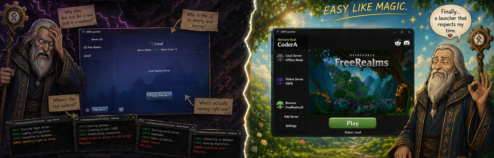

# 🧙 FreeRealmsJS Launcher

> *“Another launcher? How original. This one at least works.”*

Custom Free Realms launcher built with **PySide6** for offline play, OSFR login, server management, and single-file distribution.

---

## 🧙‍♂️ What is this?

> *“You click button. Game starts. Revolutionary.”*

FreeRealmsJS Launcher is a modern, customizable launcher for running the Free Realms client with:

- Offline/local server support  
- OSFR login integration  
- Custom server management  

All wrapped in a single, clean interface.

---

## 🗿 The Old OSFR Way

> *“Behold… the ritual of unnecessary suffering.”*

The classic OSFR launcher experience:

1. Click `start_launcher.bat`  
2. Nothing happens (yet)  
3. Question reality  
4. Click `start_server.bat`  
5. Suddenly…

💥 **5 command prompt windows appear out of nowhere**  
💥 Logs start flying  
💥 Something *might* be working  
💥 Something is definitely broken  
💥 You have no idea which is which  

> *“Ah yes… clarity.”*

Now you just sit there:

- Waiting  
- Watching black windows spam text  
- Hoping you didn’t summon a demon instead  

Eventually:

- Maybe the launcher connects  
- Maybe it doesn’t  
- Maybe one window silently died 10 minutes ago  

> *“Truly a user-friendly experience.”*

---

## 🧙 The FreeRealmsJS Way

> *“Or… you click one button like a civilized being.”*

- Press **Play**
- No ritual
- No guessing
- No command prompt army invasion

Everything starts automatically:

- Server stack ✔  
- Login ✔  
- Client ✔  

> *“Same result. Fewer existential crises.”*

---

## ✨ Features

> *“Yes, it has features. Try not to be overwhelmed.”*

- 🎮 Custom Free Realms launcher UI (PySide6)
- ⚡ One-click **offline/local server startup**
- 🌐 **OSFR server login** support
- 🧩 Custom server list (add/edit/remove)
- 📦 Single-file `.exe` build (PyInstaller)
- 💬 Discord Rich Presence
- 🎨 Themed UI with custom fonts & icons
- 🔔 Built-in popup / overlay system
- 📊 Server status display  
  `Status: Online | Players: X`

---

## 🛠 First-Time Setup

> *“Even you can manage this. Probably.”*

On first launch:

- Set your **Display Name**
- Select your **Free Realms folder** / `FreeRealms.exe`

---

## 🎯 Modes

### 🧪 Offline Mode

> *“No servers? No problem. I’ll just make some.”*

Automatically starts the local stack:

- Login server  
- Gateway  
- Auth bridge  

➡️ One click → fully local Free Realms

---

### 🌐 Online Mode (OSFR)

> *“Ah yes, other humans. How unfortunate.”*

- Login to OSFR servers
- Built-in popup authentication system

---

## 🌍 Server Management

> *“Control everything. Like a responsible wizard. Or not.”*

- Add new servers
- Edit server name & address
- Protect default profiles
- Manage everything from the UI

---

## 📌 Current Status

> *“It works. That already puts it above expectations.”*

- ✅ Offline Mode launches full local server stack  
- ✅ OSFR login popup implemented  
- 🚧 Browser profile support (coming soon™)  
- ✅ Server list fully manageable  
- ✅ Game state detection (Play → Stop Game)  
- ✅ Client process detection  

---

## ⚙️ Technical Details

> *“Magic. Fine. Python.”*

- Python + **PySide6**
- Modular file structure
- **PyInstaller (one-file build)**
- Runtime extraction system
- Bundled:
  - assets  
  - fonts  
  - icons  

---

## 🎯 Purpose

> *“Because the original launcher is gone. And we have standards.”*

This launcher exists to:

- Modernize the Free Realms launching experience  
- Simplify offline/local server usage  
- Manage multiple server profiles in one place  
- Enable easy single `.exe` distribution  

---

## 🧪 Notes

> *“No, this is not official. Obviously.”*

- Community / preservation project  
- Free Realms officially shut down in 2014  
- Projects like OSFR keep it alive  

---

## 🧙 Final Words

> *“If something breaks, it’s probably your fault.  
But fine… open an issue.”*

  

